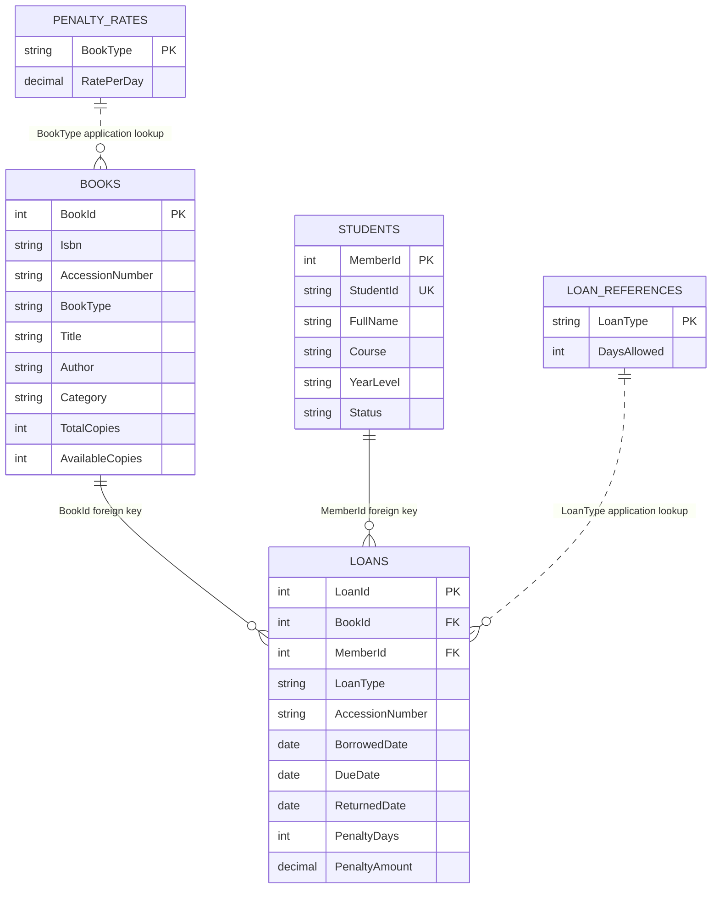

# Library Database ERD

`Loans.BookId` and `Loans.MemberId` are enforced foreign keys. `Books.BookType` and `Loans.LoanType` are application-level lookups; MySQL does not enforce those relationships with foreign keys.
